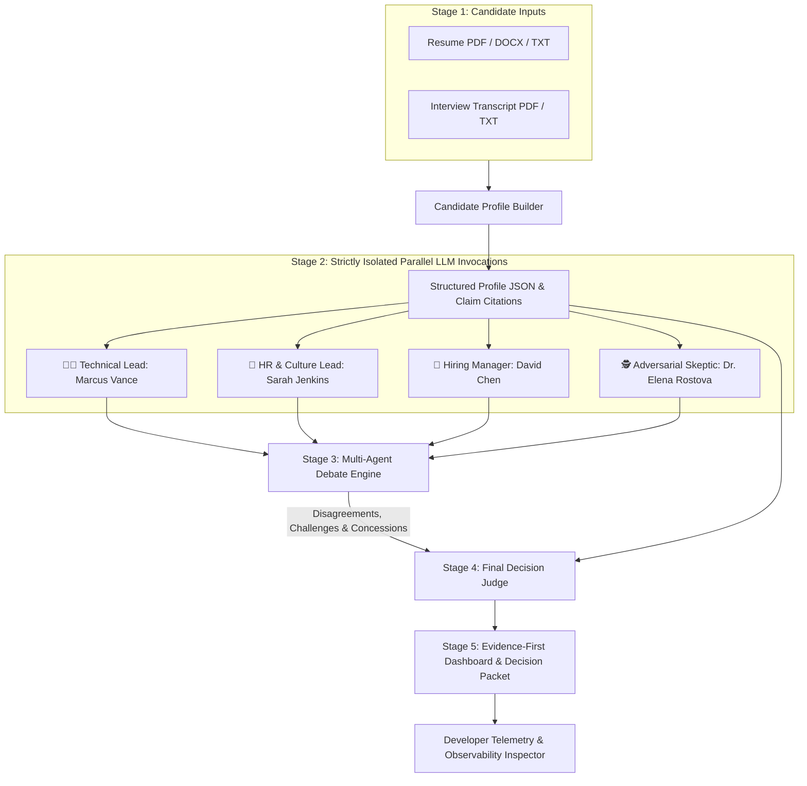

# AI Hiring Jury ⚖️
### Multi-Agent Candidate Evaluation System with Isolated Personas, Interactive Debate & Reasoned Decision Synthesis

> **"Four independent AI perspectives. One evidence-backed hiring decision."**

---

## 🚀 Overview

**AI Hiring Jury** is a full-stack, enterprise-grade AI candidate evaluation system. Rather than relying on a single generic LLM prompt that produces superficial scores, **AI Hiring Jury** orchestrates an end-to-end multi-agent pipeline:

1. **Candidate Profile Builder**: Ingests the candidate's Resume and Interview Transcript, extracting verified claims, cross-source discrepancies, and concrete evidence quotes.
2. **Four Strictly Isolated Personas**: Four independent AI agents (**Technical Lead**, **HR / Culture Lead**, **Hiring Manager**, and **Adversarial Skeptic**) analyze the candidate profile concurrently in separate LLM calls with **zero cross-agent information leakage**.
3. **Genuine Multi-Agent Debate**: The personas engage in a multi-round debate where agents challenge claims, cite transcript quotes, and actively revise their stances based on counterarguments.
4. **Final Decision Judge**: A separate reasoning-based LLM synthesizes the debate and evidence to deliver a binding hiring recommendation (**Score Averaging is Strictly Prohibited**).

---

## 🏛️ System Architecture



---

## 🎭 The Four Independent Personas

Each agent is invoked via a **separate, concurrent LLM call** (`Promise.all`) and receives **only** the Candidate Profile and raw source text. No agent sees another agent's thoughts or scores during Stage 2.

| Persona | Avatar | Role & Core Mandate | Primary Evaluation Criteria |
| :--- | :---: | :--- | :--- |
| **Technical Lead** *(Marcus Vance)* | 🧑‍💻 | Evaluates hands-on engineering depth and system design | Practical implementation vs textbook knowledge, concurrency, query optimization, API resilience. |
| **HR & Culture Lead** *(Sarah Jenkins)* | 🤝 | Evaluates behavioral maturity and interpersonal dynamics | Constructive conflict resolution, psychological safety, blameless culture, intellectual honesty. |
| **Hiring Manager** *(David Chen)* | 👔 | Evaluates business impact, velocity, and team ROI | Operational delivery, latency/cost reduction, role readiness vs platform team support dependencies. |
| **Adversarial Skeptic** *(Dr. Elena Rostova)* | 🕵️ | Audits claims for exaggerations, depth mismatches, and red flags | Contrast between resume claims vs transcript admissions, unverified credentials, timeline gaps. |

---

## ⚡ The Debate Chamber: Real Interaction & Position Revisions

Unlike static multi-perspective summaries, the **Debate Engine** orchestrates real interaction:

1. **Challenge**: The *Skeptic* challenges the *Technical Lead* on the candidate's resume claim of "Expert Kafka cluster partitioning," citing the interview transcript where the candidate conceded that a dedicated platform team managed the cluster.
2. **Revision / Concession**: The *Technical Lead* explicitly concedes the point, revising the streaming rating from *System Architect* to *Competent Application Consumer* and lowering confidence accordingly (`changedMind: true`).
3. **Cross-Examination & Defense**: The *HR Lead* highlights that the candidate's immediate verbal honesty when questioned reflects strong intellectual integrity and transparency.
4. **Synthesis**: The *Hiring Manager* clarifies that the open role requires application-level API reliability, not broker administration, leading the *Skeptic* to agree on advancing the candidate with targeted technical probes for the next round.

---

## ⚖️ Reasoning-Based Final Verdict (Anti-Averaging Rule)

The **Final Decision Judge** is explicitly forbidden from calculating a simple mathematical average:

$$\text{Naive Mean (Prohibited)} = \frac{86 + 92 + 88 + 94}{4} = 90\%$$

Instead, the Judge weights evidence credibility, the resolutions reached in debate, and remaining operational risks to render a calibrated decision:

- **Verdict**: `Proceed to Next Round`
- **Evidence-Weighted Confidence**: `84%`
- **Targeted Next-Round Probes**: High-signal questions for live coding on distributed state machines and Kubernetes pod lifecycle management.

---

## 🛠️ Tech Stack

- **Frontend**: Next.js 14 (App Router), React 18, TypeScript, Tailwind CSS, Lucide Icons.
- **Backend & Parsers**: Next.js Server-Side API Routes, `pdf-parse`, `mammoth` (DOCX), plain text streaming parser.
- **Validation**: Zod structured schema validation with automated repair prompts and fallbacks.
- **AI Orchestration**: Multi-provider architecture supporting **Google Gemini** (`gemini-3.6-flash`, `gemini-2.0-flash`), **OpenAI** (`gpt-4o`, `gpt-4o-mini`), and high-fidelity deterministic simulation fallback when no API key is supplied.

---

## 📦 Setup & Local Development

### 1. Clone & Install Dependencies
```bash
git clone <repository-url>
cd ai-hiring-jury
npm install
```

### 2. Configure Environment Variables
Create a `.env.local` file from the provided example:
```bash
cp .env.example .env.local
```

Configure your preferred LLM provider:
```env
# Google Gemini (Recommended)
GEMINI_API_KEY=your_gemini_api_key_here
LLM_MODEL=gemini-3.6-flash

# Or OpenAI Compatible API
# OPENAI_API_KEY=your_openai_api_key_here
# LLM_MODEL=gpt-4o-mini
```

*(Note: If no API key is provided, the application will automatically run in high-fidelity **Demo Simulation Mode**).*

### 3. Run Development Server
```bash
npm run dev
```
Open [http://localhost:3000](http://localhost:3000) in your browser.

---

## 🎯 2-Minute Hackathon Demo Flow

1. Open the app and click **"Try Demo Candidate (Arjun Mehta)"**.
2. Watch the live **Pipeline Progress** visualizer as it executes:
   - *Stage 1: Candidate Profile Extraction*
   - *Stage 2: 4 Isolated Concurrent Persona LLM Calls*
   - *Stage 3: Multi-Agent Interactive Debate*
   - *Stage 4: Final Judge Decision*
3. Explore the **Candidate Profile** tab to view extracted skills and discrepancy highlights.
4. Open the **4 Independent Personas** tab to see the isolated evaluations, evidence quotes, and execution isolation proofs.
5. Open the **Debate Room** tab to watch the *Skeptic* challenge the *Technical Lead* and see the *Technical Lead* revise his stance.
6. Review the **Final Verdict & Synthesis** tab to see the reasoned decision, anti-averaging audit, and targeted next-round probes.
7. Switch to the **Observability Audit** tab to inspect raw execution timestamps, token metrics, and call isolation proof.
8. Click **Export JSON** or **Print Report** in the Decision Packet tab.

---

## 📄 License
MIT License. Built for the Google DeepMind AI Agent Hackathon.
